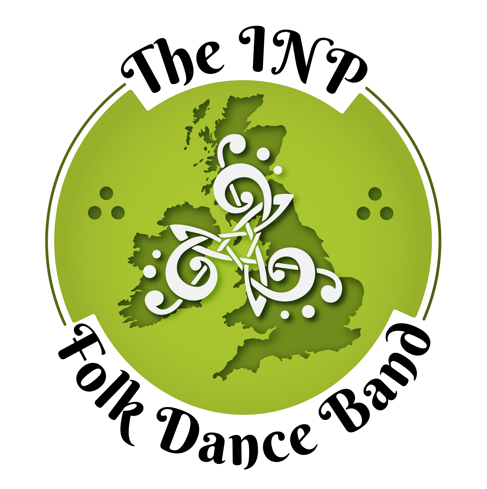
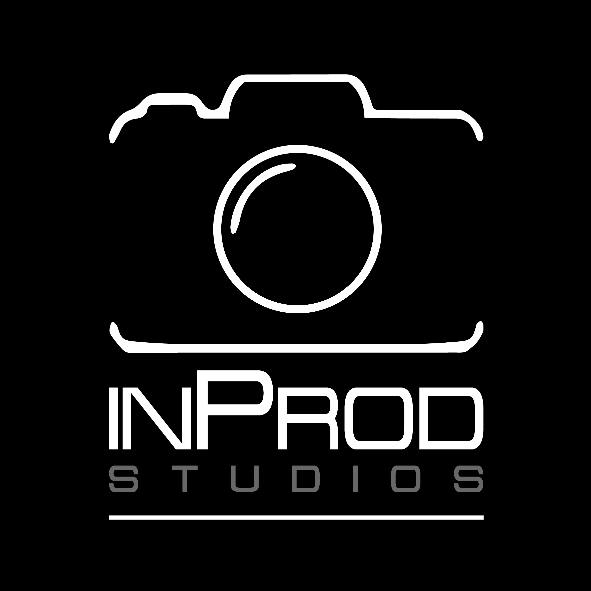

Hello, ici Thomas ! Je suis docteur-ingénieur en traitement du signal et *deep learning* et je travaille actuellement comme ingénieur maturation R&D chez Ouest-Valorisation. Bienvenue sur mon site web, vous trouverez mes [publications de recherche](papers.qmd), une partie de mes [créations artistiques personnelles](portfolio.qmd) et une collection de [liens intéressants](resources.qmd) en rapport avec mon sujet d'étude et de travail.

Je suis diplômé de l'école d'ingénieurs Grenoble INP - Phelma, UGA avec une spécialité en traitement du signal et des images et en intelligence artificielle (apprentissage automatique/*deep learning*).

Dans la foulée j'ai réalisé une thèse CIFRE chez Orange Innovation et le laboratoire IRISA à Lannion. Ma thèse, intitulée ***Compression audio monocanal par apprentissage profond*** porte sur l'utilisation des réseaux de neurones artificiels dans le développement de la prochaine génération de codecs audio.

Je pratique la musique depuis des années : clarinnetiste depuis plus de 15 ans et chanteur (chant choral) depuis 3 ans, j'ai également fait 3 ans d'accordéon et plus récemment un peu de piano en autodidacte. J'ai eu la chance de participer à l'incroyable projet d'orchestre trinational européen [Trina Orchestra](https://trina-orchestra.eu/fr/).
J'aime également prendre des photos et créer des communications visuelles (affiches, bannières, logos) pour mes différentes associations, consultables sur [mon portfolio](portfolio.qmd).

Quelques unes de mes précédentes associations :

::: {.grid}

::: {.g-col-4}

:::

::: {.g-col-4}

:::

::: {.g-col-4}

:::

:::

<!-- Hello! I'm Thomas, a PhD student working at Orange Innovation and IRISA lab (France). My thesis topic is ***Audio compression using deep learning***: the goal is to use artificial neural networks to develop the new generation of audio codecs.

I attended the engineer school called Phelma from Grenoble INP group of engineer schools (Grenoble Alpes University). I specialized in signal and image processing and machine/deep learning.

I love playing music: clarinet for more than 15 years, accordion for 3 years, and more recently piano. I had the chance to participate to 4 episodes of the amazing project [Trina Orchestra](https://trina-orchestra.eu/fr/).
I also like to take photos and create communication visuals for my associations, see [my portfolio](portfolio.qmd).

Some of my previous associations: -->

<!-- 
---
title: "Bienvenue !"
---

::: {.grid}

::: {.g-col-4}

:::

::: {.g-col-8}
Bienvenue sur mon site web ! Vous trouverez des [informations à mon sujet](about.qmd), mes [publications de recherche](papers.qmd), une partie de mes [créations artistiques personnelles](portfolio.qmd) et une collection de [liens intéressants](resources.qmd) en rapport avec mon sujet d'étude et de travail.

<!-- Welcome to my website! You can find [more about me](about.qmd), my [research work](papers.qmd), some of my [personal creative productions](portfolio.qmd) and a [collection of links to interesting resources](resources.qmd). -->

